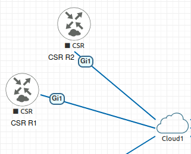
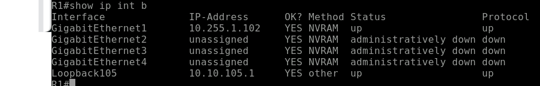
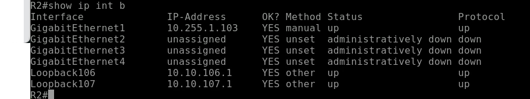
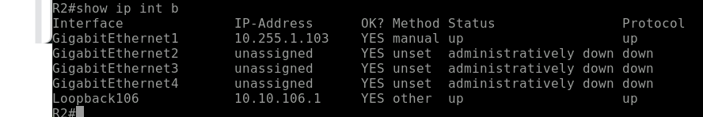

# Terraform IOS XE Loopback Automation

## Overview

This project demonstrates how to use **Terraform for Network Infrastructure as Code** to configure Cisco IOS XE devices via **RESTCONF**.

The lab automates loopback interface configuration on two routers (R1 and R2), and showcases **conditional resource creation** using Terraform `count`.

---

## Objectives

- Automate network configuration using Terraform
- Use Cisco IOS XE provider with RESTCONF
- Apply Infrastructure as Code (IaC) principles
- Demonstrate conditional logic using `count`
- Build a reusable and structured automation project

---

## Technologies Used

- Terraform
- Cisco IOS XE
- CiscoDevNet IOS XE Provider
- RESTCONF
- Infrastructure as Code (IaC)

---

## Lab Topology

- Two IOS XE routers: **R1** and **R2**
- Managed over RESTCONF
- Loopback interfaces configured via Terraform

---

## Configuration Summary

### R1
- Loopback105 → `10.10.105.1/32`

### R2
- Loopback106 → `10.10.106.1/32`
- Optional:
  - Loopback107 → `10.10.107.1/24` (controlled by variable)

---

## 🔄 Conditional Logic (Key Concept)

This project demonstrates conditional resource creation:

count = var.enable_secondary_loopback ? 1 : 0

true → resource is created
false → resource is skipped

---

## 🔍 Verification

### ✅ R1 Loopback Configuration

The following output confirms that Loopback105 was successfully configured on R1 using Terraform.

---

### ✅ R2 Loopback (Secondary Enabled)

When `enable_secondary_loopback = true`, Terraform creates an additional loopback interface (Loopback107) on R2.

---

### 🚫 R2 Loopback (Secondary Disabled)

When `enable_secondary_loopback = false`, Terraform does not create Loopback107, only Loopback106.

---

## Security Notes

- All credentials and IPs shown are from a lab environment
- No production systems are exposed
- Sensitive files are excluded using `.gitignore`

